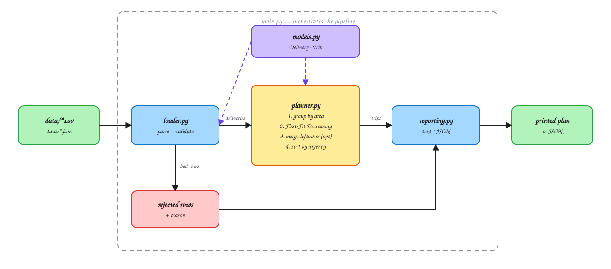

# Delivery Route Planner

A small Python program that reads delivery requests from a file and puts them into
vehicle trips. It respects the 10 kg limit, keeps each area together, and sends the
urgent deliveries out first.

Plain Python 3.8+, no libraries to install.

## Setup

There is nothing to install. The project uses only the Python standard library, so you
can run it directly with Python 3.8 or newer.

If you prefer to work inside a virtual environment:

Linux or macOS:

```bash
python3 -m venv .venv
source .venv/bin/activate
```

Windows (PowerShell):

```powershell
python -m venv .venv
.venv\Scripts\Activate.ps1
```

When you are finished, `deactivate` leaves the environment.

## How to run

```bash
python main.py data/deliveries.csv
```

Other things you can do:

```bash
python main.py data/deliveries.json            # JSON input also works
python main.py data/edge_cases.csv             # a messy file, shows the validation
python main.py data/edge_cases.csv --merge-leftovers
python main.py data/deliveries.csv --capacity 12
python main.py data/deliveries.csv --json      # output as JSON instead of text
```

Tests:

```bash
python -m unittest discover tests
```

## Input format

I chose CSV as the main format because the assignment shows the data as a table, and CSV
is the closest thing to that. JSON with the same four keys also works. The program picks
the parser from the file extension, so you don't pass a flag.

CSV:

```csv
id,area,priority,weight
1,Nasr City,2,4.5
2,Maadi,1,2.0
3,Nasr City,3,1.2
4,Zamalek,1,7.0
5,Maadi,2,3.5
```

JSON (same data):

```json
[
  { "id": "1", "area": "Nasr City", "priority": 2, "weight": 4.5 },
  { "id": "2", "area": "Maadi",     "priority": 1, "weight": 2.0 },
  { "id": "3", "area": "Nasr City", "priority": 3, "weight": 1.2 },
  { "id": "4", "area": "Zamalek",   "priority": 1, "weight": 7.0 },
  { "id": "5", "area": "Maadi",     "priority": 2, "weight": 3.5 }
]
```

The fields: `id` is unique, `area` is the destination name, `priority` is a whole number
where lower means more urgent, and `weight` is kg and must be above zero.

Sample files are in `data/`. There is `deliveries.csv` and `deliveries.json` with the data
from the assignment, `edge_cases.csv` which I made messy on purpose, and two empty files
to check the program doesn't crash on them.

## Example output

```
DELIVERY PLAN
Vehicle capacity: 10 kg

Trip 1: Zamalek  |  7.0/10 kg  (70%)  |  most urgent: P1
    #4    Zamalek        P1     7.0 kg

Trip 2: Maadi  |  5.5/10 kg  (55%)  |  most urgent: P1
    #2    Maadi          P1     2.0 kg
    #5    Maadi          P2     3.5 kg

Trip 3: Nasr City  |  5.7/10 kg  (57%)  |  most urgent: P2
    #1    Nasr City      P2     4.5 kg
    #3    Nasr City      P3     1.2 kg

SUMMARY
    Trips planned      : 3
    Deliveries planned : 5
    Deliveries skipped : 0
    Total weight moved : 18.2 kg
    Average fill rate  : 61%
```

## Project structure



The diagram source is `docs/architecture.excalidraw` if you want to open it on
excalidraw.com.

```
main.py        the command line part
loader.py      reads the file and checks each row
models.py      the Delivery and Trip classes
planner.py     the actual algorithm
reporting.py   printing the result
data/          sample input files
docs/          the diagram
tests/         unit tests
```

I split it this way so each file has one job. If something is wrong with parsing it is in
`loader.py`, if the trips are wrong it is in `planner.py`. `models.py` has almost no logic,
just the two classes and the capacity check.

## Edge cases and what I decided

| Case | What I do | Why |
| --- | --- | --- |
| No deliveries at all | Print an empty plan and a zero summary, exit normally | Nothing to plan is a normal result, not an error |
| Package heavier than 10 kg | Put it in a `NOT PLANNED` list with the reason | No vehicle can carry it, but the dispatcher still needs to see it |
| Same priority on many deliveries | Heavier one first, then the order in the file | Keeps the output the same every run, and packs a bit better |
| Next package doesn't fit | Try the other open trips of the same area first, then open a new one | Otherwise the space left in earlier trips is wasted |
| Trip is exactly 10.0 kg | Allowed | See the float note below |
| Weight is text, negative, or missing / id missing or repeated | Rejected with the reason | One bad row shouldn't stop the whole file |
| `"nasr  city"` and `"Nasr City"` | Same area | Data typed by humans is never consistent |
| Area is empty | Goes under `Unspecified` | The package still has to be delivered |

About the float: `4.5 + 3.5 + 2.0` in Python gives `10.000000000000002`, not `10.0`. So a
simple `total <= capacity` check refuses a trip that is actually exactly full. I found this
while testing and now every capacity check uses a small tolerance (`1e-9`).

---

## Reasoning questions

### 1. Explain your solution approach in your own words.

The two rules pull in different directions, so the first thing I did was decide what each
one is actually for:

- **Area** decides *who can share a trip*. It is about grouping.
- **Priority** decides *when the trip goes out* and *who takes the space first*. It is
  about order.

Once I saw it that way the rest was easier. The program works in three passes.

First it reads the file and checks every row. Good rows become `Delivery` objects, bad rows
go into a separate list with a reason. Then the good ones are put into buckets by area.

Second it packs each bucket. Inside one area I sort by priority, then by weight from heavy
to light, then by the original file order. Each delivery goes into the first open trip of
that area that still has space. If no trip has space, a new one opens. This is First-Fit
Decreasing, which is a well known greedy method for bin packing.

Third it sorts the finished trips by the most urgent package inside them, so the dispatcher
sends out the urgent ones first.

One thing that happens on purpose: a priority 3 package can end up in a trip whose most
urgent package is priority 1. I thought about this and decided it is fine. The trip leaves
at the same time either way, so nothing urgent is delayed, and the empty space gets used
instead of wasted.

The heavy-to-light sorting matters more than I expected. Big packages go in while the trips
are still empty, and the small ones fill the gaps they leave behind. If you sort the other
way the small packages spread out everywhere and then the heavy ones have nowhere to go.

### 2. What was the most difficult part of the assignment?

Deciding how strict to be about "grouped together where reasonably possible".

If I read it strictly, a trip can never mix areas. With the sample data that gives three
trips that are only 55 to 70 percent full, which felt wasteful. If I read it loosely, the
vehicle is used better but the grouping rule stops meaning anything.

In the end I did both. By default the program never mixes areas, which is the safe reading.
Then I added a flag `--merge-leftovers` which allows mixing, but only for trips that are
almost empty. So the strict behaviour is the default and the loose one is something the
dispatcher turns on when they want it, not something the program does quietly.

The second hard part was the floating point problem I described above. It took me a while
to understand why a trip that should be exactly full was being rejected.

### 3. Are there situations where your algorithm may not produce the best possible grouping?

Yes, and I found a clear one in my own code.

Bin packing is an NP-hard problem, so any simple greedy method is only an approximation.
First-Fit Decreasing on its own stays within about 22 percent of the best answer, but my
version sorts by priority first and only by weight inside each priority level, so even that
guarantee does not really apply here.

Here is a case where my program wastes a trip. One area, capacity 10:

| id | priority | weight |
| --- | --- | --- |
| A | 1 | 4.0 |
| B | 1 | 4.0 |
| C | 2 | 6.0 |
| D | 2 | 6.0 |

My program makes **three** trips: `[A, B] = 8`, `[C] = 6`, `[D] = 6`. But **two** full trips
exist: `[A, C] = 10` and `[B, D] = 10`. The problem is that A and B are both priority 1, so
they get paired with each other before the 6 kg packages are even looked at, and after that
nothing is left that fits next to a 6.

This is the price of using priority as a sorting key and not only as a dispatch order. I
accepted it, because one extra trip costs less than an urgent package losing its space. A
small improvement pass after packing would fix most of these cases.

Other weaknesses I know about:

- Two areas with 1 kg each become two trips by default. The merge flag exists for this.
- The area is only a text string. Nasr City and Heliopolis are close to each other in real
  life and Zamalek is far from both, but the program has no way to know that. Real grouping
  would need coordinates or a distance table.

### 4. If the input contained 1,000,000 delivery requests, what part of your solution might become slow or memory-intensive?

The packing loop is the problem. For every delivery it walks through the open trips of its
area looking for space. If an area has *k* open trips that is O(k) per delivery, so one area
with a million rows is O(n²), which is around 10¹¹ comparisons. That is the part that would
really stop working.

The fix is to keep the open trips in something sorted by remaining space, like a heap or a
balanced tree, so finding a trip with room is O(log k) instead of O(k). That makes the whole
pass O(n log n).

The merge feature is worse. It compares every pair of under-filled trips and repeats until
nothing more fits, so it is O(m²) per round. It is fine for a few hundred trips and useless
for a few hundred thousand. It would need the trips bucketed by weight range.

For memory, the loader reads the whole file into a list before it plans anything, and every
delivery stays in memory because the trips hold references to them. A million objects in
Python is a few hundred MB, which works but is wasteful. Reading the file row by row, and
using `__slots__` instead of a normal dataclass, would cut it a lot. The sorting is
O(n log n) and is not the issue.

### 5. What would you improve if you had another day to work on the solution?

1. Better packing. Switch from first-fit to best-fit with a sorted structure, and add a pass
   at the end that tries to empty the last almost-empty trip by swapping packages around.
2. Real distances. Let a delivery carry coordinates and group by distance instead of by an
   exact area name, so nearby areas can share a vehicle naturally.
3. More than one vehicle type. Right now the capacity is one number for everything. A real
   fleet has different sizes and a limited number of each.
4. Reading the file as a stream for very large inputs, and a `--max-trips` option for when
   the fleet is smaller than the plan needs.
5. Random tests. My tests use fixed cases. Generating random delivery lists and checking the
   rules always hold (never over capacity, every delivery placed once, same output every
   run) would catch more than I can think of by hand.

---

## The extra feature: merging almost-empty trips

Run it with `--merge-leftovers`.

After the normal plan is built, the program looks at trips that are below 50 percent full
(you can change this with `--merge-threshold`) and tries to combine them into one vehicle,
as long as the total still fits. Trips that are already well filled are never touched, and
the capacity rule is never broken.

**Why I picked this one.** It is the direct answer to the hardest sentence in the
assignment. "Where reasonably possible" means there is a point where it stops being
reasonable, and a van driving all the way to Heliopolis with 1 kg inside is that point.
Instead of guessing where the line is and hiding my guess in the code, I made the strict
behaviour the default and gave the dispatcher a switch, with the threshold as the dial.
Mixed trips are marked `[mixed]` in the output, so the trade-off is visible instead of
hidden.

On `data/edge_cases.csv` it goes from 6 trips at 51 percent average fill to 5 trips at 61
percent.